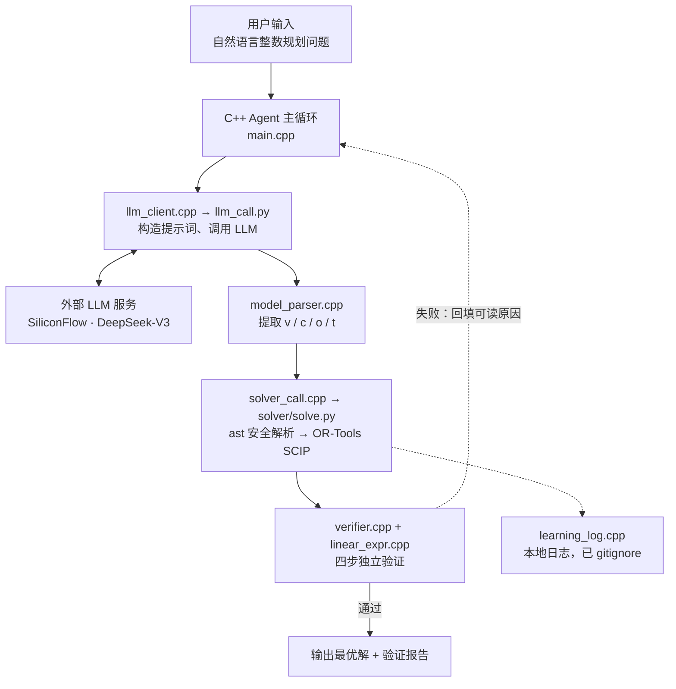

# ad-planner · 自然语言整数规划求解 Agent 原型

把一段自然语言描述的整数规划问题，自动转换成数学模型、调用求解器求解，
并对结果做独立验证。C++ 负责编排与验证，Python 只负责计算。

> **项目定位**：这是一个**原型**，不是成熟的智能优化系统。
> 它验证的是「求解结果是否满足 LLM 给出的那个数学模型」，
> **不保证**「LLM 给出的数学模型是否忠实于原始问题」——后者需要人工核查。
> 各部分的真实成熟度见下方[当前状态](#当前状态)与[已知限制](#已知限制)。

---

## 当前状态

| 能力 | 状态 | 说明 |
| --- | --- | --- |
| 自然语言 → 数学模型 | ✅ 可用 | 由 LLM 生成 JSON 模型，质量取决于提示词与模型能力 |
| 线性/整数线性求解 | ✅ 可用 | OR-Tools SCIP，支持整数与连续变量、maximize/minimize |
| 表达式解析 | ✅ 可用 | 基于 Python `ast` 的安全解析，不使用 `eval` |
| 结果独立验证 | ✅ 可用 | 四步验证：结构 → 整数性 → 逐条约束代入 → 目标值重算 |
| 失败重试 | ✅ 可用 | 最多 3 次，把**可读的错误原因**回填给 LLM 重新建模 |
| 模型忠实性验证 | ❌ 未实现 | 无法判断 LLM 建出的模型是否忠实于原题，需人工核查 |
| 多目标 / 非线性 | ❌ 不支持 | 仅支持单目标线性模型 |

**这个重试机制不叫"自演化"**：它只是失败后带着错误信息重新问一次 LLM，
没有模型参数更新，也没有跨任务的能力积累。仓库里保留的
`learning_log.cpp` 是行为日志，不是学习机制。

---

## 架构



也可以直接看 [`docs/architecture.svg`](docs/architecture.svg)。

**关键设计**

- **C++ 是编排层**：主循环、LLM 调用、模型解析、求解器调度、结果验证。
- **Python 是计算层**：`solve.py` 只做「模型 → 求解」，不含任何 Agent 逻辑，
  因此可以脱离 C++ 单独测试。
- **验证是独立的一环**：`verifier.cpp` 不信任求解器返回的目标值，而是把解
  重新代入原始约束与目标函数自行计算一遍。

---

## 仓库构成

仓库里目前有**两套互不调用的代码**，请按需取用：

| 目录 / 文件 | 属于 | 说明 |
| --- | --- | --- |
| `src/`（除 `ip_solver.cpp`）、`solver/solve.py`、`solver/llm_call.py` | **通用 NLP→整数规划 Agent** | 本仓库主线，与具体案例无关 |
| `src/ip_solver.cpp`、`solver/ip_solver.py`、`agent/agent.py`、`run.bat` | **广告投放规划案例** | 独立案例（优格麦片推广），用暴力枚举求解，与主线无代码关系 |

> 后续计划把广告案例拆到单独仓库，让本仓库聚焦通用 Agent。
> 在拆分之前，本节的作用是避免读者困惑"入口到底是 `./ad-planner` 还是 `run.bat`"。

---

## 快速开始

### 1. 依赖

- C++17 编译器（g++ / clang++ / MSVC）
- Python 3.9+，以及 `ortools`、`requests`
- 一个 SiliconFlow API Key（只跑离线求解与测试时不需要）

```bash
pip install ortools requests
```

### 2. 编译

```bash
make clean && make
```

Windows 上没有 `make` 时，直接一条命令：

```bash
g++ -std=c++17 -Wall -O2 -Isrc -o ad-planner.exe \
    src/main.cpp src/llm_client.cpp src/model_parser.cpp \
    src/solver_call.cpp src/verifier.cpp src/learning_log.cpp \
    src/linear_expr.cpp
```

### 3. 配置 API Key

**不要把 Key 写进任何文件**。用环境变量：

```bash
# Linux / macOS
export SILICONFLOW_API_KEY="your_api_key"

# Windows PowerShell
$env:SILICONFLOW_API_KEY = "your_api_key"
```

### 4. 运行

```bash
./ad-planner "某工厂生产甲、乙两种产品。甲每件利润3元，乙每件利润5元。\
甲每件用设备2小时，乙用1小时，共12小时。甲每件用原料3单位，乙用1单位，共18单位。求最大利润。"
```

下面这段是**离线集成测试**的输出（取自 `tests/test_agent_pipeline.py` 的实跑记录）。
该测试把 LLM 的网络调用替换成了返回固定响应的桩：

> ⚠️ **这不是真实大模型的运行结果。**
> 它用于验证 C++ 控制层、模型解析、求解器调用与结果验证这条链路，
> **不代表真实大模型的建模准确率**。
> 真实调用大模型的记录见
> [`examples/real_llm_run_before_fix.txt`](examples/real_llm_run_before_fix.txt)。

```
=== AdPlanner Agent ===
问题: 某工厂生产甲、乙两种产品。甲每件利润3元，乙每件利润5元。甲每件用设备2小时，乙用1小时，共12小时。甲每件用原料3单位，乙用1单位，共18单位。求最大利润。

[尝试 1/3] 调用 LLM...
LLM 返回的模型 JSON: {"v":["x:甲产品数量","y:乙产品数量"],"c":["2*x + 1*y <= 12","3*x + 1*y <= 18"],"o":"3*x + 5*y","t":"maximize"}

模型提取成功:
  变量: x(甲产品数量), y(乙产品数量)
  约束数: 2
  目标: 3*x + 5*y (maximize)
调用求解器...

=== 解算成功 ===
状态: OPTIMAL
最优值: 60
最优解:
  x (甲产品数量) = 0
  y (乙产品数量) = 12

=== 独立验证 ===
  [通过] 结构检查通过：2 个变量取值均有限
  [通过] 整数性检查通过：2 个整数变量取值均为整数
  [通过] 约束检查通过：2/2 条约束全部满足
  [通过] 目标值检查通过：重算 60 与报告值一致
```

设 `ADPLANNER_LOG=off` 可关闭本地日志。

### 5. 测试

```bash
make test          # 全部：C++ 核心 + Python + 端到端集成
make test-cpp      # 只跑 C++ 测试
make test-py       # 只跑 Python 测试
make test-e2e      # 只跑端到端集成测试（需先编译出 ad-planner）
```

**Windows 上没有 `make` 时**，用这个脚本代替（会自动找 g++ / clang++ 并编译）：

```bash
python tests/run_all.py
```

也可以不装 C++ 编译器，只跑 Python 部分：

```bash
python tests/test_parser.py
python tests/test_known_cases.py
```

端到端集成测试用 `tests/stub_llm_call.py` 替换掉 LLM 网络调用，
因此**不需要 API Key、不联网**，跑的是真实的 C++ 链路，但**不是**真实模型的输出。
它检验的是「C++ 控制层这条链路通不通」，不是「模型建得对不对」。
桩每一次返回哪个模型由测试夹具显式指定（环境变量 `STUB_SCENARIO`），
不由题目文本关键词决定——避免把题面写成含暗号的假题目。


---

## 支持范围

### 模型层面

| 支持 | 说明 |
| --- | --- |
| 线性目标函数 | `0.16*a + 0.6*b + 0.27*c` |
| 线性约束 | `<=`、`>=`、`=`，两侧都可以含变量 |
| 最大化 / 最小化 | `maximize` / `minimize` |
| 整数变量 | `integer_vars` 中列出的变量按整数处理 |
| 连续变量 | 未列入 `integer_vars` 的按连续变量处理 |

### 表达式层面

| 支持 | 示例 |
| --- | --- |
| 隐式乘法 | `2*x` 与 `2x` 都可以 |
| 省略系数 | `x` 等价于 `1*x` |
| 括号与一元负号 | `(a + b)*2`、`-0.5*x` |
| 除以常数 | `x/2` |
| 科学计数法 | `1e-3*x` |
| Unicode 数学符号 | `≤`、`≥`、`×`、`÷` |

### 不支持（会被明确拒绝，不会静默算错）

| 不支持 | 说明 |
| --- | --- |
| 变量 × 变量 | 非线性，返回"仅支持线性模型" |
| 除以含变量的式子 | 返回"不允许除以含变量的式子" |
| 变量幂、绝对值、min/max 函数 | 同上 |
| 多目标 | 仅支持单目标 |
| 二次目标 / 二次约束 | 同上 |

---

## 已知限制

1. **变量默认非负且无上界**。需要上界必须显式写成约束。
   所有变量都按 `[0, +∞)` 创建——原模型若需要负变量或上界，必须在约束里写清楚。
2. **不验证模型的忠实性**。验证器保证的是「解满足 LLM 给出的模型」，
   不保证「模型忠实于用户的原题」。LLM 漏读一个约束，
   验证器抓不到。这一点目前只能靠人工核查 `normalized_model`。
3. **每次求解都新起一个 Python 进程**，通过临时 JSON 文件通信。
   大模型规模下开销明显，也没有增量求解。
4. **重试上限 3 次**，且重试依赖 LLM 能读懂错误信息。
5. **没有做提示词注入防护**。用户输入会直接进入 LLM 提示词，
   如果问题文本里包含恶意指令，可能影响建模结果。
6. **Windows 上的中文编码已处理，但仍有边界情况**：
   程序内部已统一使用 UTF-8（参数从宽字符命令行重取、控制台设为 UTF-8、
   编译加 `-fexec-charset=UTF-8`）。但如果显式传入的 Python 解释器路径
   本身含非 ASCII 字符，窄字符进程调用会被 cmd.exe 破坏；
   推荐让 `python` 位于 PATH 上并使用默认行为。
7. **大模型规模未优化**。没有做模型预处理、约束稀疏化、增量求解。

---

## 测试

```
$ make test

==== C++ 核心测试（线性表达式解析 + 解验证）====
  全部 37 项通过

==== Python 表达式解析测试 ====
  全部 31 项通过

==== Python 端到端已知答案测试 ====
  全部 5 个案例通过

==== 端到端集成测试（LLM 调用替换为桩）====
  全部 4 个场景通过
```

### 已知答案案例（`tests/test_known_cases.py`）

每个案例的期望值直接由题面推出并写死在测试里（**不取自程序输出**），
再与「独立实现的暴力枚举」对拍，三方一致才算通过。

| # | 案例 | 类型 | 期望目标值 | 期望最优解 |
| --- | --- | --- | --- | --- |
| 1 | 工厂生产计划 | 两变量最大化 | 60 | x=0, y=12 |
| 2 | 0/1 背包（三件物品） | 带 0/1 上界 | 8000 | x1=0, x2=1, x3=1 |
| 3 | 投资规划 | 混合系数目标函数 | 60 | a=0, b=100, c=0 |
| 4 | 饲料混合 | 最小化 + `>=` 约束 | 1.9 | x=3, y=2 |
| 5 | 整数性关键案例 | LP 松弛解不可行 | 12 | x=0, y=3 |

案例 3 是**回归案例**：它的目标函数字符串取自历史运行日志，正是曾经被
错算成 `0.08` 的那道题。详见 [`docs/FIXES.md`](docs/FIXES.md)。

### 集成测试场景（`tests/test_agent_pipeline.py`）

只把 LLM 网络调用换成桩，其余全部是真实代码路径：

| # | 场景 | 验证点 |
| --- | --- | --- |
| 1 | 工厂生产计划 | 一次成功；四步验证报告齐全 |
| 2 | 投资规划 | 目标值是 60 而不是 0.08；验证报告齐全 |
| 3 | 夹具构造"约束引用了未声明的变量" | 求解层报出可读原因 → 反馈重试 → 第 2 次成功 |
| 4 | 夹具构造"约束互相矛盾（无解）" | 识别 INFEASIBLE → 反馈重试 → 第 2 次成功 |

四个场景使用的都是**信息完整**的题目——约束条件、资源限量、收益率等
全部写在题面里（见测试文件顶部的 `PROBLEM_*` 常量）。桩返回的模型与题面
一一对应，不存在"题面缺约束、模型却多出约束"的情况。
场景 3、4 里第一次返回的错误模型是**测试夹具人为构造**的，用于触发重试分支。

完整的离线运行记录（含上述四个场景的逐行输出）见
[`examples/demo_transcript.txt`](examples/demo_transcript.txt)，不需要 API Key；
真实大模型调用记录见
[`examples/real_llm_run_before_fix.txt`](examples/real_llm_run_before_fix.txt)。


---

## 一次真实的调试记录：0.08 与 60

**现象**：投资规划示例（三种投资、收益率 8%/12%/9%、总资金 500 万）
在真实运行日志里给出的最优值是 `0.08`——"500 万资金的最大收益是 8 分钱"。

**根因**：`solver/solve.py` 的表达式解析用正则逐段匹配，对
`0.08*2*a + 0.12*5*b + 0.09*3*c` 这种混合系数写法，**第一条命中的是
"裸数字"分支并直接返回**，已累计的项被丢弃，目标函数退化成常数 `0.08`。
求解器"成功"地最大化了一个常数，状态标记为 success。

**危险之处**：这是**静默错误**——不抛异常、不打日志、不报错，只是答案错了。
发现它靠的是人工核对时看到"8 分钱"不合常理，而不是任何自动化手段。
这也正是本项目要单独做「独立验证」这一环的原因。

**修复**：用 Python `ast` 白名单重写解析层（不再对 LLM 文本用 `eval`），
并在验证器中加入**目标值重算比对**；修复后同一输入返回 **60 万**
（对应"500 万全部投入收益率最高的 B 类"），与直觉一致。

完整的分析、代码片段，以及顺着这条线索挖出的另外两个 bug
（剥代码围栏差一错误、Windows 中文编码导致接口报错），见
[`docs/FIXES.md`](docs/FIXES.md)；对应的真实调用日志见
[`examples/real_llm_run_before_fix.txt`](examples/real_llm_run_before_fix.txt)。

---

## AI 辅助开发的说明

本项目采用 **AI 辅助开发**方式。**技术方案与代码主要由 AI 完成**，
本人主要负责提出功能需求、运行程序、检查输出结果，
并针对发现的问题向 AI 反馈和迭代。

具体来说：

- **提出需求**：确定这个项目要做什么——把自然语言描述的整数规划问题
  自动化地走完"建模 → 求解 → 验证"这条流程。
- **运行并检查**：把项目跑起来，逐个查看输出结果，对照常识判断结果对不对。
  例如投资规划示例输出"500 万资金的最大收益是 0.08 元"，
  这个数字显然不合理，就是在这里被注意到的。
- **反馈与迭代**：把发现的问题反馈给 AI，借助 AI 辅助分析并修改表达式解析、
  结果验证及测试模块，然后重新运行、通过已知答案案例检查修复效果。
- **复核结论**：对修复前后的结果做对比（0.08 → 60），确认测试全部通过。

这部分工作的定位是**需求提出、问题发现与结果复核**：
"这个数字看着不对"这一步由本人完成；从现象到根因的分析与代码修改
借助了 AI。修复过程中的分析与技术细节见 [`docs/FIXES.md`](docs/FIXES.md)。

这个项目让本人进一步理解了自然语言建模、优化求解及结果验证的基本流程，
也认识到 AI 生成的代码需要通过独立测试和人工核查来确认正确性——
尤其是"静默错误"：崩溃会告诉你出了问题，
而静默错误只会给你一个看起来正常的错答案。

---

## 目录结构

```
ad-planner/
├── src/          # C++ 编排层：主循环、LLM 调用、模型解析、求解调度、
│                 #   四步验证、线性表达式解析
│                 #   （ip_solver.cpp 是广告投放案例的独立入口）
├── solver/       # Python 计算层：solve.py（模型 → 求解）、llm_call.py、ip_solver.py
├── agent/        # 广告投放案例的 Python 入口
├── tests/        # C++ 核心测试 + Python 测试 + 端到端集成测试（含 LLM 桩）
├── docs/         # architecture.svg（架构图）、FIXES.md（问题分析与修复记录）
├── examples/     # demo_transcript.txt            离线运行记录
│                 # real_llm_run_before_fix.txt    真实大模型调用记录（修复前）
│                 # learning_log.sample.txt        日志格式的脱敏示例
├── Makefile      # 构建与测试入口
├── run.bat       # 广告投放案例的 Windows 启动脚本
├── .env.example
└── .gitignore
```

> 完整的逐文件清单见 [`docs/FIXES.md`](docs/FIXES.md) 第 8 节。

> 说明：本仓库交付时未在本地验证过 `make`（开发环境中未安装 make），
> 但 Makefile 中每条编译命令都等价于实际跑通过的单行 `g++` / `clang++` 命令。
> 若 `make` 报错，请用上文「编译」一节里的单行命令。

---

## 引用与致谢

- 求解器：[Google OR-Tools](https://developers.google.com/optimization)（SCIP）
- LLM：SiliconFlow 平台的 DeepSeek-V3

## 许可

未指定许可证。如需引用或复用其中代码，请先联系仓库作者。
