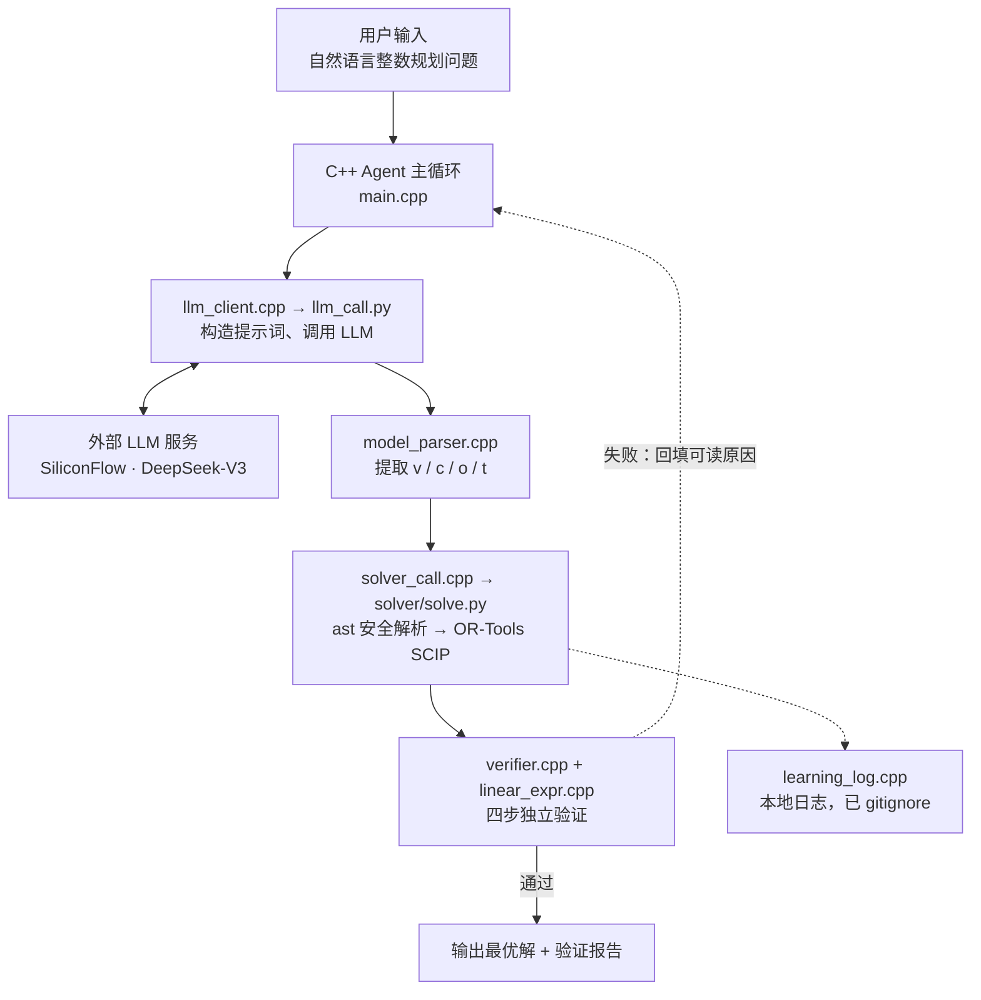

# ad-planner · 自然语言整数规划求解 Agent 原型

把一段自然语言描述的整数规划问题，自动转换成数学模型、调用求解器求解，
并对结果做独立验证。C++ 负责编排与验证，Python 只负责计算。

> **项目定位**：这是一个**原型**，不是成熟的智能优化系统。
> 它验证的是「求解结果是否满足 LLM 给出的那个数学模型」，
> **不保证**「LLM 给出的数学模型是否忠实于原始问题」——后者需要人工核查。
> 各部分的真实成熟度见下方[当前状态](#当前状态)与[已知限制](#已知限制)。

---

## 当前状态

| 能力 | 状态 | 说明 |
| --- | --- | --- |
| 自然语言 → 数学模型 | ✅ 可用 | 由 LLM 生成 JSON 模型，质量取决于提示词与模型能力 |
| 线性/整数线性求解 | ✅ 可用 | OR-Tools SCIP，支持整数与连续变量、maximize/minimize |
| 表达式解析 | ✅ 可用 | 基于 Python `ast` 的安全解析，不使用 `eval` |
| 结果独立验证 | ✅ 可用 | 四步验证：结构 → 整数性 → 逐条约束代入 → 目标值重算 |
| 失败重试 | ✅ 可用 | 最多 3 次，把**可读的错误原因**回填给 LLM 重新建模 |
| 模型忠实性验证 | ❌ 未实现 | 无法判断 LLM 建出的模型是否忠实于原题，需人工核查 |
| 多目标 / 非线性 | ❌ 不支持 | 仅支持单目标线性模型 |

**这个重试机制不叫"自演化"**：它只是失败后带着错误信息重新问一次 LLM，
没有模型参数更新，也没有跨任务的能力积累。仓库里保留的
`learning_log.cpp` 是行为日志，不是学习机制。

---

## 架构



也可以直接看 [`docs/architecture.svg`](docs/architecture.svg)。

**关键设计**

- **C++ 是编排层**：主循环、LLM 调用、模型解析、求解器调度、结果验证。
- **Python 是计算层**：`solve.py` 只做「模型 → 求解」，不含任何 Agent 逻辑，
  因此可以脱离 C++ 单独测试。
- **验证是独立的一环**：`verifier.cpp` 不信任求解器返回的目标值，而是把解
  重新代入原始约束与目标函数自行计算一遍。

---

## 仓库构成

仓库里目前有**两套互不调用的代码**，请按需取用：

| 目录 / 文件 | 属于 | 说明 |
| --- | --- | --- |
| `src/`（除 `ip_solver.cpp`）、`solver/solve.py`、`solver/llm_call.py` | **通用 NLP→整数规划 Agent** | 本仓库主线，与具体案例无关 |
| `src/ip_solver.cpp`、`solver/ip_solver.py`、`agent/agent.py`、`run.bat` | **广告投放规划案例** | 独立案例（优格麦片推广），用暴力枚举求解，与主线无代码关系 |

> 后续计划把广告案例拆到单独仓库，让本仓库聚焦通用 Agent。
> 在拆分之前，本节的作用是避免读者困惑"入口到底是 `./ad-planner` 还是 `run.bat`"。

---

## 快速开始

### 1. 依赖

- C++17 编译器（g++ / clang++ / MSVC）
- Python 3.9+，以及 `ortools`、`requests`
- 一个 SiliconFlow API Key（只跑离线求解与测试时不需要）

```bash
pip install ortools requests
```

### 2. 编译

```bash
make clean && make
```

Windows 上没有 `make` 时，直接一条命令：

```bash
g++ -std=c++17 -Wall -O2 -Isrc -o ad-planner.exe \
    src/main.cpp src/llm_client.cpp src/model_parser.cpp \
    src/solver_call.cpp src/verifier.cpp src/learning_log.cpp \
    src/linear_expr.cpp
```

### 3. 配置 API Key

**不要把 Key 写进任何文件**。用环境变量：

```bash
# Linux / macOS
export SILICONFLOW_API_KEY="your_api_key"

# Windows PowerShell
$env:SILICONFLOW_API_KEY = "your_api_key"
```

### 4. 运行

```bash
./ad-planner "某工厂生产甲、乙两种产品。甲每件利润3元，乙每件利润5元。\
甲每件用设备2小时，乙用1小时，共12小时。甲每件用原料3单位，乙用1单位，共18单位。求最大利润。"
```

真实输出（取自 `tests/test_agent_pipeline.py` 的实跑记录，未经修饰）：

```
=== AdPlanner Agent ===
问题: 某工厂生产甲、乙两种产品。甲每件利润3元，乙每件利润5元。求最大利润。

[尝试 1/3] 调用 LLM...
LLM 返回的模型 JSON: {"v":["x:甲产品数量","y:乙产品数量"],"c":["2*x + 1*y <= 12","3*x + 1*y <= 18"],"o":"3*x + 5*y","t":"maximize"}

模型提取成功:
  变量: x(甲产品数量), y(乙产品数量)
  约束数: 2
  目标: 3*x + 5*y (maximize)
调用求解器...

=== 解算成功 ===
状态: OPTIMAL
最优值: 60
最优解:
  x (甲产品数量) = 0
  y (乙产品数量) = 12

=== 独立验证 ===
  [通过] 结构检查通过：2 个变量取值均有限
  [通过] 整数性检查通过：2 个整数变量取值均为整数
  [通过] 约束检查通过：2/2 条约束全部满足
  [通过] 目标值检查通过：重算 60 与报告值一致
```

设 `ADPLANNER_LOG=off` 可关闭本地日志。

### 5. 测试

```bash
make test          # 全部：C++ 核心 + Python + 端到端集成
make test-cpp      # 只跑 C++ 测试
make test-py       # 只跑 Python 测试
make test-e2e      # 只跑端到端集成测试（需先编译出 ad-planner）
```

**Windows 上没有 `make` 时**，用这个脚本代替（会自动找 g++ / clang++ 并编译）：

```bash
python tests/run_all.py
```

也可以不装 C++ 编译器，只跑 Python 部分：

```bash
python tests/test_parser.py
python tests/test_known_cases.py
```

端到端集成测试用 `tests/stub_llm_call.py` 替换掉 LLM 网络调用，
因此**不需要 API Key、不联网**，但跑的是真实的 C++ 链路。


---

## 支持范围

### 模型层面

| 支持 | 说明 |
| --- | --- |
| 线性目标函数 | `0.16*a + 0.6*b + 0.27*c` |
| 线性约束 | `<=`、`>=`、`=`，两侧都可以含变量 |
| 最大化 / 最小化 | `maximize` / `minimize` |
| 整数变量 | `integer_vars` 中列出的变量按整数处理 |
| 连续变量 | 未列入 `integer_vars` 的按连续变量处理 |

### 表达式层面

| 支持 | 示例 |
| --- | --- |
| 隐式乘法 | `2*x` 与 `2x` 都可以 |
| 省略系数 | `x` 等价于 `1*x` |
| 括号与一元负号 | `(a + b)*2`、`-0.5*x` |
| 除以常数 | `x/2` |
| 科学计数法 | `1e-3*x` |
| Unicode 数学符号 | `≤`、`≥`、`×`、`÷` |

### 不支持（会被明确拒绝，不会静默算错）

| 不支持 | 说明 |
| --- | --- |
| 变量 × 变量 | 非线性，返回"仅支持线性模型" |
| 除以含变量的式子 | 返回"不允许除以含变量的式子" |
| 变量幂、绝对值、min/max 函数 | 同上 |
| 多目标 | 仅支持单目标 |
| 二次目标 / 二次约束 | 同上 |

---

## 已知限制

1. **变量默认非负且无上界**。需要上界必须显式写成约束。
   所有变量都按 `[0, +∞)` 创建——原模型若需要负变量或上界，必须在约束里写清楚。
2. **不验证模型的忠实性**。验证器保证的是「解满足 LLM 给出的模型」，
   不保证「模型忠实于用户的原题」。LLM 漏读一个约束，
   验证器抓不到。这一点目前只能靠人工核查 `normalized_model`。
3. **每次求解都新起一个 Python 进程**，通过临时 JSON 文件通信。
   大模型规模下开销明显，也没有增量求解。
4. **重试上限 3 次**，且重试依赖 LLM 能读懂错误信息。
5. **没有做提示词注入防护**。用户输入会直接进入 LLM 提示词，
   如果问题文本里包含恶意指令，可能影响建模结果。
6. **Windows 上的中文编码已处理，但仍有边界情况**：
   程序内部已统一使用 UTF-8（参数从宽字符命令行重取、控制台设为 UTF-8、
   编译加 `-fexec-charset=UTF-8`）。但如果显式传入的 Python 解释器路径
   本身含非 ASCII 字符，窄字符进程调用会被 cmd.exe 破坏；
   推荐让 `python` 位于 PATH 上并使用默认行为。
7. **大模型规模未优化**。没有做模型预处理、约束稀疏化、增量求解。

---

## 测试

```
$ make test

==== C++ 核心测试（线性表达式解析 + 解验证）====
  全部 37 项通过

==== Python 表达式解析测试 ====
  全部 31 项通过

==== Python 端到端已知答案测试 ====
  全部 5 个案例通过

==== 端到端集成测试（LLM 调用替换为桩）====
  全部 4 个场景通过
```

### 已知答案案例（`tests/test_known_cases.py`）

每个案例同时用「手工推导的期望值」和「独立实现的暴力枚举」校验，
三方一致才算通过。

| # | 案例 | 类型 | 期望目标值 | 期望最优解 |
| --- | --- | --- | --- | --- |
| 1 | 工厂生产计划 | 两变量最大化 | 60 | x=0, y=12 |
| 2 | 0/1 背包（三件物品） | 带 0/1 上界 | 8000 | x1=0, x2=1, x3=1 |
| 3 | 投资规划 | 混合系数目标函数 | 60 | a=0, b=100, c=0 |
| 4 | 饲料混合 | 最小化 + `>=` 约束 | 1.9 | x=3, y=2 |
| 5 | 整数性关键案例 | LP 松弛解不可行 | 12 | x=0, y=3 |

案例 3 是**回归案例**：它的目标函数字符串取自历史运行日志，正是曾经被
错算成 `0.08` 的那道题。详见 [`docs/FIXES.md`](docs/FIXES.md)。

### 集成测试场景（`tests/test_agent_pipeline.py`）

只把 LLM 网络调用换成桩，其余全部是真实代码路径：

| # | 场景 | 验证点 |
| --- | --- | --- |
| 1 | 工厂生产计划 | 一次成功；四步验证报告齐全 |
| 2 | 投资规划 | 目标值是 60 而不是 0.08；验证报告齐全 |
| 3 | 约束引用了未声明的变量 | 求解层报出可读原因 → 反馈重试 → 第 2 次成功 |
| 4 | 约束互相矛盾（无解） | 识别 INFEASIBLE → 反馈重试 → 第 2 次成功 |

真实的运行记录见 [`examples/demo_transcript.txt`](examples/demo_transcript.txt)
（离线可跑，不需要 API Key）。


---

## 一次真实的调试记录：0.08 与 60

这是本仓库最值得讲的一段经历，也是把它放进科研申请材料时最有价值的素材。

**现象**：投资规划示例（三种投资、收益率 8%/12%/9%、总资金 500 万）
在日志里的最终目标函数值是 `0.08`。而"500 万资金的最大收益是 8 分钱"
显然不合理。

**定位**：`solver/solve.py` 的 `parse_expr()` 用一条正则逐段匹配表达式。
把 LLM 输出的 `0.08*2*a + 0.12*5*b + 0.09*3*c` 丢进去，正则的**第一条命中**
不是变量项，而是"裸数字"分支匹配到的 `0.08`：

```
#1 span=(0, 4)   groups=(None, None, '0.08')  text='0.08'   ← 第一条就命中
#2 span=(5, 8)   groups=('2', 'a', None)      text='2*a'
...
```

而裸数字分支是**直接 return** 的——拿着 0.08 就返回了，
把已经累计的项全部丢弃。于是目标函数退化成一个常数，
求解器"成功"地最大化了一个常数，报告 0.08 并标记成功。

**这是一个静默错误**：不抛异常、不打日志、不报错，只是答案错了。
如果不是人工核对"500 万的最大收益是 0.08"这个明显不合理的数字，
这个 bug 会一直留在仓库里。

**修复与验证**：
- 用 Python `ast` 重写表达式解析：白名单校验语法树，按线性代数规则求值，
  不再使用 `eval`（顺带消掉了对 LLM 文本执行 `eval` 的注入面）。
- 在 `Verifier` 里加入**目标值重算比对**：把解代回目标函数重算一遍，
  与求解器报告的值比对。这样即便未来解析层再出问题，验证层也能兜住。
- 写回归测试：直接把日志里那个字符串作为输入，断言系数是
  `0.16 / 0.6 / 0.27`、目标值是 `60`，并用暴力枚举独立验证。

修复后同一个输入的结果是 **60 万**——对应"500 万全部投入收益率最高的 B 类
（12%）"，与直觉一致。

**顺着这条线索又挖出两个 bug**，都在补测试的过程中暴露：

1. **LLM 输出解析的差一错误**：剥代码块围栏时写成 `b1 + 6`，而 `"```json"`
   是 7 个字符，于是模型字符串开头永远多一个 `n`。这正是历史日志里每条
   记录都有那行莫名 "n" 的原因。
2. **Windows 中文编码**：`argv` 是运行库按 ANSI 代码页转来的，中文问题会变
   成 GBK 字节，再按 UTF-8 发出去就是非法 UTF-8，接口直接拒绝。
   这一条解释了日志里**第一条**失败记录 `code 20015 The parameter is invalid`
   ——当时误以为是提示词写错了，其实是编码问题。

完整分析见 [`docs/FIXES.md`](docs/FIXES.md)。

---

## AI 辅助开发的说明

本项目在开发过程中使用了 AI 辅助。为避免夸大个人贡献，这里如实说明：

**AI 辅助的部分**

- 初始版本的代码骨架、提示词文本、部分解析函数由 AI 生成。
- 本次修复中，AI 协助完成了：表达式解析层的重构（`ast` 方案）、
  `linear_expr.cpp` 的编写、测试用例的批量生成、以及 README 与文档的初稿。

**本人完成的部分**

分工上，AI 产出的是"代码"，下面这些是"判断"——它们决定了代码往哪写：

- **把项目跑起来并发现问题**。在真实运行中注意到日志里
  "500 万资金最大收益 0.08"与常识不符。这是整条修复链的起点：
  一个数字看着不对。
- **判断问题的性质**。确认这不是"模型答得不好"，而是代码在解析环节
  静默出错。这个判断决定了后面所有工作的方向——如果是前者，
  正确的做法是换提示词；如果是后者，换多少次提示词都没用。
- **定修复原则**。不接受"绕过"（例如换一个更听话的模型、或把约束
  改写成模板硬编码），要修掉解析层本身；同时明确：不信任求解器
  的自报结果，必须独立复算。这两条原则约束了后面每一个实现选择。
- **定验收标准**。用"已知答案 + 暴力枚举"交叉验证。测试用例的期望值
  先人工推导、写死在测试里，再拿程序去对——而不是从程序输出里抄一份
  当作期望值，否则测试只证明"代码和昨天的自己一致"，无法充当裁判。
- **逐行审查 AI 生成的代码**。核对解析层是否真的拒绝非线性项、
  验证器是否真的把解逐条代回约束、跨平台改动有没有破坏原有逻辑；
  补齐 AI 漏掉的边界情况（除以变量、括号不匹配、非整数解、空输入）。
- **做前后对比并确认可复现**。修复前记录 0.08，修复后确认 60，
  且全部测试通过；同时把历史日志里的另两处异常（多出来的 `n`、
  中文编码导致的接口报错）一并回溯出根因。

**这些代码我能讲清楚**：正则为什么会在 `0.08` 处提前返回、
`ast` 白名单为什么能防注入、验证器为什么要重算目标值而不是信任求解器、
以及"静默错误"为什么比崩溃更危险——崩溃会告诉你出了问题，
静默错误只会给你一个看起来正常的错答案。

---

## 目录结构

```
ad-planner/
├── src/
│   ├── main.cpp             # Agent 主循环：编排 + 失败重试
│   ├── llm_client.cpp/.h    # LLM 调用（子进程 + 环境变量传 Key）
│   ├── model_parser.cpp/.h  # 从 LLM 响应中提取 JSON 模型
│   ├── solver_call.cpp/.h   # 调用 Python 求解层，跨平台临时文件
│   ├── verifier.cpp/.h      # 四步独立验证
│   ├── linear_expr.cpp/.h   # 线性表达式解析（验证器的基础）
│   ├── shell_command.h      # 跨平台命令行拼接，规避 cmd.exe 引号怪癖
│   ├── learning_log.cpp/.h  # 本地运行日志
│   └── ip_solver.cpp        # 广告投放案例（独立入口）
├── solver/
│   ├── solve.py             # 求解层：ast 安全解析 → OR-Tools SCIP
│   ├── llm_call.py          # LLM 调用脚本
│   └── ip_solver.py         # 广告投放案例（暴力枚举）
├── agent/agent.py           # 广告投放案例的 Python 入口
├── tests/
│   ├── test_linear_expr.cpp     # C++ 测试：解析 + 验证
│   ├── test_parser.py           # Python 测试：表达式解析
│   ├── test_known_cases.py      # 端到端已知答案测试
│   ├── test_agent_pipeline.py   # 真实 C++ 链路集成测试
│   ├── stub_llm_call.py         # 集成测试用的 LLM 桩
│   ├── make_demo_transcript.py  # 生成运行记录
│   └── run_all.py               # 不依赖 make 的一键测试
├── docs/
│   ├── architecture.svg     # 架构图
│   └── FIXES.md             # 问题分析与修复记录
├── examples/
│   ├── demo_transcript.txt      # 真实离线运行记录
│   └── learning_log.sample.txt  # 日志格式的脱敏示例
├── run.bat                  # 广告投放案例的 Windows 启动脚本
├── .env.example
├── .gitignore
└── Makefile
```

> 说明：本仓库在交付时未在本地验证过 `make`（开发环境中未安装 make），
> 但 Makefile 中每条编译命令都等价于实际跑通过的单行 `g++` / `clang++` 命令。
> 若 `make` 报错，请用 README「编译」一节里的单行命令。

---

## 引用与致谢

- 求解器：[Google OR-Tools](https://developers.google.com/optimization)（SCIP）
- LLM：SiliconFlow 平台的 DeepSeek-V3

## 许可

未指定许可证。如需引用或复用其中代码，请先联系仓库作者。
